# 软件需求规格说明书

项目主题：CoTask——AI 赋能的大学生课程小组协作辅助平台

任课教师：邓水光

项目成员：王浩雄 李涵 高烨辉 洪宇童 龙永奇 仇国智

## 1 引言

### 1.1 编写目的

本文档旨在详细阐述“AI 赋能的大学生课程小组协作辅助平台”的软件需求规格，以指导开发团队设计和实现一个智能、高效、易用的课程协作辅助系统。本文档将明确该平台在小组分工规划、进度管理、灵感共享以及团队权限控制等方面的核心功能与约束条件，旨在为后续的开发与测试工作提供依据，确保交付的软件产品符合预期需求。

### 1.2 项目背景

在现今的大学教育体系中，课程小组协作（Group Work）已成为极为普遍的学习与考核方式。然而，在实际协作过程中，大学生群体普遍面临着显著的痛点：“任务设置与拆解模糊”导致分工难以落实，“进度失控”导致临近截止日期（DDL）突击乱做，而“缺乏灵感与参考案例”则直接拔高了项目的冷启动门槛。而传统的通用型任务管理工具（如任务清单、思维导图等工具）往往缺乏针对高校课程小组协作场景的深度定制与智能辅助。

为此，开发一款专注于大学生群体、基于 AI 深度赋能的课程小组协作辅助平台显得尤为迫切。本平台通过 AI 深度赋能，致力于解决大学生课程协作中的双重核心诉求：

1. **管理愿景：**通过 **AI 辅助的项目树构建** 与 **动态依赖时间轴**，将复杂的学期任务拆解为可执行、有执行期限的最小单元，实现团队协作的透明化与高效化。
2. **灵感愿景：** 打造 **“全链条渗透”的灵感广场**，为任务的每个阶段（规划、执行）提供创意参考与成熟模板，降低协作的冷启动门槛，实现集体智慧的复用 。

### 1.3 名词定义

在本文档中，我们定义以下名词：

- AI：人工智能（Artificial Intelligence），指通过算法模型对数据进行分析、推理和生成的技术。在本系统中，AI 主要用于任务拆解建议、项目树生成、任务分配辅助、每日进度建议以及灵感内容推荐等功能。

- DDL：截止日期（Deadline），指任务必须完成的最晚时间节点。在本系统中，DDL 用于驱动小组任务推进、展示任务紧急程度，并提醒成员合理安排时间。

- 项目树：指以树状结构表示课程小组任务层级关系的模型，用于将复杂的大任务逐步拆解为多个子任务，并明确各任务之间的从属关系。

- 时间轴：指按照时间顺序对任务进行可视化展示的视图，用于反映任务的开始时间、截止时间、执行顺序和依赖关系，帮助小组成员直观掌握整体进度。

- 灵感广场：指本系统中的课程协作知识共享模块，用于发布、浏览、收藏和复用课程协作模板、优秀案例、经验总结和工具推荐等内容。

- 技能标签：指用于描述用户能力特征的标识信息，如“文献综述”“PPT 设计”“演讲表达”“数据分析”等。在本系统中，技能标签可用于辅助任务分配与成员协作匹配。

- 任务依赖关系：指任务之间存在的前后约束关系，即一个任务必须在另一个任务完成后才能启动。例如“文献阅读完成后才能开始 PPT 制作”。

- 课程协作模板：指针对特定课程或作业类型预先整理好的项目树结构、分工方案及时间规划方案，可供用户在创建项目时直接导入和复用。

- 个性化每日建议：指系统根据用户当前分工、任务状态和小组整体进度，由AI自动生成的每日任务推进建议，用于帮助用户明确当天应优先完成的工作。

- API：应用程序编程接口（Application Programming Interface），是系统各模块之间或系统与外部服务之间进行数据交互和功能调用的一组标准接口。

- 数据库：用于存储用户信息、课程信息、任务结构、时间安排、技能标签、灵感内容及互动记录等业务数据的持久化存储系统。

- HTML：超文本标记语言(Hypertext Markup Language)，用于描述因特网上的网页文档结构和内容。

- CSS：层叠样式表(Cascading Style Sheets)，用于控制网页元素的样式和布局。
  
- DBMS：数据库管理系统(Database Management System)，用于管理数据库及其相关软件的集合，提供数据存储、维护和应用系统。
  
- VUE：Vue.js 是一套用于构建用户界面的渐进式 JavaScript 框架，被广泛应用于单页面应用程序 (SPA) 和复杂的前端开发项目中。它具有简洁的 API、高效的性能和灵活的组件化特性，使得开发者可以快速构建交互式的 Web 应用程序。

- Flask：Flask 是一个轻量级的 Python Web 框架，用于快速构建 Web 应用程序和
  RESTful API。它具有简单、灵活的特点，提供了基本的功能和组件，同时支持扩展和定制，适用于中小型 Web 项目和快速原型开发。Flask 的设计理念是“简单而不失灵活”，可以根据项目需求选择合适的扩展和中间件进行定制。

- Docker：Docker 是一种容器化平台，用于打包、发布和运行应用程序及其依赖项的轻量级容器。它提供了一种标准化的部署方式，使得应用程序在不同环境中具有一致的运行行为。

## 2 总体描述

### 2.1 产品前景

本平台旨在提供一个集成化、智能化的大学生小组协作解决方案。通过该系统，小组长（管理者）可以利用 AI 一键生成并微调项目树结构，轻松完成从宏观课程要求到原子操作的递归式拆解；组员可以透过直观的个人仪表盘和甘特图时间轴，清晰掌握个人权责与截止日期。

同时，平台内嵌的“灵感广场”将作为创意与知识共享社区贯穿任务全生命周期，使用户在启动期能一键复用成熟模板，在执行期能快速查阅参考案例，在总结期能沉淀与分享自身的优秀方案。该软件预期将大幅提升高校学生团队协作的透明度、公正性与执行效率，彻底改变传统小组协作的混沌状态。

### 2.2 用户类及其特征

本平台的主要用户群体为在校大学生，根据其在不同课程小组中承担的角色，我们将用户类定义为以下两种核心特征（注：同一用户可加入不同小组，在不同小组中可扮演不同角色）：

| **用户分类**          | **描述**                                                     |
| --------------------- | ------------------------------------------------------------ |
| **组长**              | 小组的核心管理者，实行“组长负责制”。拥有小组管理、项目树与时间轴的完全编辑权。需要清晰的全局排期视图、AI 智能拆解辅助以及团队进度监控功能。 |
| **组员**              | 任务的具体执行者。主要关注个人视角的任务执行。需要清晰的待办列表、DDL 预警提醒、个人任务状态的流转权，以及针对具体原子任务的灵感指导。 |
| **内容分享者/消费者** | 平台所有用户在“灵感广场”中的泛化身份。具有浏览、搜索、下载干货资料的需求，同时也具备上传个人优秀方案、点赞、收藏及交流的互动需求。 |

### 2.3 产品功能

基于上述核心场景与业务逻辑，本平台的主要功能划分为以下四大模块：

| **产品功能模块**       | **主要服务对象** | **详细描述**                                                 |
| ---------------------- | ---------------- | ------------------------------------------------------------ |
| **个人任务与智能提醒** | 组长、组员       | 提供个人视角的任务 Dashboard，汇聚展示按时间排序的待办列表，并提供 AI 个性化执行建议与执行进度预警，为组长提供小组整体工作进度报告。 |
| **项目树与时间轴管理** | 组长、组员       | 提供递归式任务拆解的项目树视图与甘特图排期表。组长可通过 AI 对话或导入模板完成任务结构的生成与编辑，组员查看完整项目树、排期表，也可聚焦查看“与自己有关”的节点。 |
| **灵感广场社区**       | 组长、组员       | 全链条渗透的资源库。提供课程模板、优秀案例、干货资料的全局搜索与多维度筛选，支持用户上传、分享、点赞及一键导入项目树模板。 |
| **成员身份与权限管理** | 组长、组员       | 跨课程的小组身份管理、技能标签设置、组长转让机制以及小组的建立、解散与人员邀退。 |

### 2.4 运行环境

- 网站应在主流的现代 Web 浏览器上运行良好，包括但不限于 Google Chrome、 Mozilla Firefox、Apple Safari 和 Microsoft Edge。确保网站在不同版本的浏览器中都能提供一致的用户体验和功能支持。
- 网站应支持常见的操作系统，包括 Windows、 Mac OS 和 Linux，以确保用户可以在不同的操作系统下访问和使用网站。确保网站在不同操作系统上的兼容性和稳定性，提供统一的用户体验。
- 网站采用响应式设计，能够根据用户设备的屏幕大小和分辨率自动调整布局和样式，以确保在桌面电脑、平板 电脑和移动设备上都能提供良好的用户体验。确保网站在不同设备上的可访问性和易用性，使用户无论在何时何地都能方便地访问和使用网站。

### 2.5 设计和实现上的约束

本平台将采用现代Web应用开发技术，以实现系统的高效性、可扩展性和良好的用户体验。在设计和实现过程中，需要考虑以下约束条件：

- 跨平台兼容性：系统应能够在主流操作系统和设备环境下稳定运行，包括 Windows、macOS、Linux 以及常见移动终端。系统前端应采用响应式设计，确保在 PC、平板和手机等不同屏幕尺寸下均能正常显示和使用。

- 易用性约束：本系统的主要用户为大学生课程小组成员，因此界面设计应简洁清晰、操作流程应尽可能直观，避免过于复杂的配置过程，降低系统的学习成本和使用门槛。

- 任务结构清晰性约束：系统必须能够以结构化方式表达课程作业中的任务拆解过程，确保项目树结构层次明确、依赖关系合理、任务归属清晰，避免因结构混乱影响成员理解与执行。

- 时间管理可视化约束：系统需要将任务DDL、任务依赖和成员分工在时间轴中进行直观展示，以保证组员和组长均可快速掌握当前进度和潜在风险。因此，系统在设计上必须支持时间信息和任务结构信息的统一呈现。

- AI结果合理性约束：系统中的AI功能主要起辅助作用，包括项目树生成、任务分配建议、每日建议和灵感推荐等。AI生成结果必须允许用户审阅、修改和重构，不能完全替代用户决策，以防止因推荐不合理而影响项目执行。

- 权限控制约束：系统中不同角色具有不同操作权限。普通组员主要查看和执行分配给自己的任务，组长拥有项目树调整、任务细化和整体时间安排管理等更高权限。因此，系统在实现中需要保证角色权限清晰、边界明确。

- 数据安全与隐私保护约束：系统需要保存用户个人信息、课程任务信息和小组协作数据，因此在设计与实现中必须采取必要的数据保护措施，防止用户信息泄露、任务数据丢失或被未授权访问。

- 内容共享规范性约束：灵感广场中的模板、案例和经验内容可能由用户上传和共享，因此系统需要考虑内容审核、版权归属、信息真实性与不良内容过滤等问题，确保共享社区健康有序运行。

- 性能与并发约束：当多个课程小组同时使用系统、频繁进行任务编辑、时间轴刷新和AI对话时，系统应保持较好的响应速度和稳定性，避免因页面卡顿或服务延迟影响协作效率。

- 可维护性与可扩展性约束：系统在架构设计时应考虑后续功能扩展需求，例如接入更多课程模板、引入新的AI能力、增加积分系统或优化推荐逻辑等。因此应尽量采用模块化设计和规范化接口，提高系统后期维护与升级效率。

- 可测试性约束：系统应具备良好的测试条件，便于开展单元测试、集成测试和系统测试。对于任务管理、权限控制、时间轴展示和AI建议等关键功能，应具备明确的测试场景和可验证结果。

- 技术选型和实现规范约束：系统应优先选择成熟稳定、社区活跃、文档完善的开发技术与框架，并遵循主流的软件工程规范与编码规范，以保证系统实现质量、开发效率和后续维护能力。

### 2.6 假设和依赖

#### 2.6.1 用户方面

- 计算机使用能力：假设本系统用户具备基本的计算机和互联网使用能力，能够完成浏览器访问、页面点击、表单填写、文件上传和内容查看等常见操作。

- 课程协作参与意愿：假设用户愿意以课程小组为单位开展协作，愿意按照系统中定义的任务结构和时间安排参与小组工作，并及时更新自己的任务完成情况。

- 对任务拆解方式的理解能力：假设用户能够理解项目树、子任务、依赖关系、DDL等基本概念，并根据系统中的可视化结构识别自己在小组中的职责与任务位置。

- 对AI辅助结果的基本认知：假设用户能够理解AI给出的任务拆解、分工建议和每日建议仅作为辅助参考，而非绝对结论，并能够结合实际课程要求进行判断和调整。

- 设备和浏览器条件：假设用户拥有可访问互联网的终端设备，并能够使用主流浏览器访问本系统，如 Chrome、Edge、Firefox、Safari 等，以确保页面和交互功能能够正常运行。

- 账号与身份信息真实性：假设用户在注册和使用系统过程中提供的基础身份信息、课程信息和技能标签具有基本真实性，以便系统进行合理的分工建议和个性化推荐。

- 安全使用意识：假设用户具备基本的信息安全意识，能够妥善保管账号密码，不随意泄露个人敏感信息，并避免在公共不安全环境下进行重要操作。

#### 2.6.2 服务器方面

- 服务器资源满足基本需求：假设部署系统的服务器在处理器、内存、存储和网络带宽等方面能够满足本系统日常访问、任务管理和AI辅助服务调用的基本需求。

- 运行环境兼容性假设：假设服务器操作系统、Web服务环境、数据库系统及相关中间件之间具有良好的兼容性，能够稳定支撑系统部署与运行。

- 持续服务能力假设：假设服务器能够在学期内提供持续稳定的在线服务，保证用户在日常课程协作过程中能够随时访问系统并进行任务操作。

- 数据库稳定性假设：假设数据库系统能够稳定保存和读取用户信息、课程数据、项目树数据、时间轴数据及社区内容，不发生频繁故障或严重数据损坏。

- 依赖AI服务可用性：系统中的项目树生成、任务推荐和每日建议等功能依赖AI模型服务，因此系统依赖相关AI服务具备较好的可用性、响应速度和基础准确性。

- 依赖系统性能优化：系统依赖后端服务、数据库查询、缓存机制和接口调用的合理优化，以保证在多用户同时使用时仍具有可接受的响应时间和稳定性。

#### 2.6.3 网络方面

- 网络连接稳定性假设：假设用户终端与服务器之间具有较为稳定的网络连接，能够正常完成页面加载、任务同步、文件上传和AI建议请求等操作。

- 网络可用性假设：假设校园网、家庭网络或移动网络能够提供持续可用的访问条件，不会频繁出现长时间中断，以保障系统的正常使用。

- 依赖网络传输性能：系统中的时间轴展示、页面交互、社区内容加载和AI服务调用都依赖网络传输性能，因此系统运行效果在一定程度上依赖用户和服务器之间的带宽与延迟情况。

- 依赖外部服务网络连通性：若系统接入第三方AI接口、对象存储服务或消息通知服务，则系统依赖与这些外部服务之间的网络连通性，以保证相关功能能够正常执行。

### 2.7 用户文档

产品交付将为用户提供三类文档：描述类文档、过程类文档、参考类文档，主要帮助用户快速上手本平台，并在实际使用过程中通过查阅文档及时解决常见问题。

#### 2.7.1 描述类文档

- 提供用户注册、登录和个人信息维护的操作说明，包括如何创建账号、完善资料和设置技能标签。

- 提供课程项目创建与加入的操作说明，包括如何创建课程小组、选择身份角色以及加入已有项目。

- 提供项目树创建与编辑的操作说明，包括如何通过导入模板、上传课程要求文档或与AI对话生成初始项目树。

- 提供任务拆解与分工设置的操作说明，包括如何新增子任务、设置负责人、补充权责描述以及调整任务层级。

- 提供时间轴查看与进度跟踪的操作说明，包括如何切换周/月视图、查看任务依赖关系和识别即将到期任务。

- 提供首页任务DDL与每日建议的操作说明，包括如何查看个人任务清单、理解AI建议内容及更新任务完成状态。

- 提供灵感广场浏览与互动的操作说明，包括如何查看模板、收藏内容、发表评论以及一键导入模板到当前项目。

- 提供个人贡献与成就模块的操作说明，包括如何发布经验内容、查看个人贡献记录和管理个人展示信息。

#### 2.7.2 过程类文档

- 提供用户从注册到加入课程小组的流程说明，包括身份验证、信息填写和角色分配流程。

- 提供课程项目初始化流程说明，包括项目创建、课程要求录入、AI生成项目树及人工确认调整流程。

- 提供任务拆解与细化流程说明，包括从粗粒度大纲建立到子任务逐步细化、责任分配和DDL设定的完整过程。

- 提供时间管理与进度推进流程说明，包括任务上线、依赖配置、状态更新、进度汇总和风险预警流程。

- 提供AI辅助建议使用流程说明，包括AI建议的生成逻辑、用户查看方式、修改确认和人工调整流程。

- 提供灵感广场内容使用流程说明，包括模板浏览、内容筛选、导入复用、评价反馈和内容二次共享流程。

- 提供小组协作管理流程说明，包括组长对项目树、时间轴和人员分工的统一调整流程，以及普通组员对个人任务的执行反馈流程。

#### 2.7.3 参考类文档

- 提供项目树构建示例，包括读书报告、社会实践、课程展示等典型课程作业的项目树模板示例。

- 提供任务拆解示例，包括将“大作业汇报”拆解为资料收集、文献阅读、PPT制作、演讲准备、现场展示等子任务的实例。

- 提供技能标签设置示例，包括不同类型学生常见的技能标签组合示例，帮助用户更合理地维护个人能力画像。

- 提供时间轴安排示例，包括跨周任务规划、并行任务安排、依赖关系设置和DDL分布示例。

- 提供AI建议使用示例，包括“今日建议进度”“风险预警提示”“任务调整建议”等内容的典型展示样例。

- 提供灵感广场内容示例，包括优秀案例、项目模板、经验贴和工具推荐等参考样本，帮助用户理解社区内容格式与价值。

### 2.8 术语表

| 术语         | 术语解释                                                     |
| :----------- | :----------------------------------------------------------- |
| 软件         | 软件是一系列按照特定顺序组织的计算机数据和指令的集合，用于实现特定功能并支持用户完成具体任务。 |
| 软件需求     | 软件需求是用户为解决问题或达成目标所需的条件、能力及其文档化描述，包括功能性需求和非功能性需求。 |
| 用户需求     | 用户需求描述了用户在使用本系统时必须完成的任务和期望达到的目标，例如完成课程任务拆解、跟踪进度和进行小组协作。 |
| 功能需求     | 功能需求定义了系统必须提供的具体功能，如项目树生成、任务分工、时间轴展示、AI建议生成和灵感广场内容共享等。 |
| 非功能需求   | 非功能需求指系统在性能、安全性、易用性、可维护性、兼容性等方面需要满足的质量属性和约束条件。 |
| 业务需求     | 业务需求反映了开发该系统的高层目标，即帮助大学生课程小组更高效地完成协作任务、降低启动成本并提升任务管理质量。 |
| 需求工程     | 需求工程是对软件系统需求进行获取、分析、定义、验证和管理的过程，用于明确系统目标和边界，并形成规范化需求文档。 |
| 用例图       | 用例图是描述系统参与者与系统功能之间关系的静态视图，可用于表示学生、组长等角色与系统功能模块之间的交互关系。 |
| 软件生存周期 | 软件生存周期是软件从立项、需求分析、设计、实现、测试、部署、维护到退役的全过程。 |
| 软件质量     | 软件质量是软件满足明确需求和隐含需求的程度，体现为功能正确性、稳定性、易用性和可维护性等特征。 |
| 软件过程     | 软件过程是开发高质量软件所需完成的一系列活动和步骤，包括需求分析、系统设计、编码实现、测试验证和维护等。 |
| 权限控制     | 权限控制是指根据不同用户角色授予不同系统操作能力的机制，用于保障数据安全和协作秩序。 |
| AI辅助决策   | AI辅助决策是指系统利用人工智能模型为用户提供任务拆解、任务分配、进度建议和内容推荐等参考意见，但最终决策仍由用户做出。 |

## 3 系统功能

### 3.1 用户需求

本节根据核心场景梳理了用户的具体功能需求及优先级排列：

| **序号** | **优先级** | **角色** | **需求内容**                                                 |
| -------- | ---------- | -------- | ------------------------------------------------------------ |
| 1        | 高         | 组长     | 能够通过上传课程要求文档或与 AI 对话，自动生成、微调并编辑“项目树”与任务节点。 |
| 2        | 高         | 组员     | 能够在其首页（Dashboard）清晰看到所有课程的待办原子任务、截止日期，并能推进任务状态。 |
| 3        | 高         | 组长     | 能够在“时间轴”视图中以甘特图形式查看团队排期，并将原子任务精准映射至对应组员的日期区间。 |
| 4        | 高         | 组长     | 能够进行组员管理，包括邀请入组、踢出组员、转让组长身份或解散小组。 |
| 5        | 中         | 全体     | 能够进入“灵感广场”按课程或类别搜索资源，并能在具体的任务节点详情中一键跳转查看对应的参考案例。 |
| 6        | 中         | 全体     | 能够在项目完成后，将本组的优秀方案、文档或整个项目树架构作为模板分享发布至“灵感广场”。 |
| 7        | 低         | 组长     | 能够在项目初始化时，根据组员档案中的“技能”标签，获取 AI 自动分配任务的智能建议。 |
| 8        | 低         | 全体     | 能够接收 AI 智能提醒，包括临近 DDL 的紧急预警和基于当前进度的每日执行建议。 |

### 3.2 用例图

#### 3.2.1 参与者说明

| 参与者             | 说明                                                         |
| ------------------ | ------------------------------------------------------------ |
| **用户（User）**   | 所有已注册登录的平台使用者，是组长与组员的泛化父类           |
| **组员（Member）** | 继承用户，参与具体课程小组、执行分配任务的普通成员           |
| **组长（Leader）** | 继承组员，拥有项目树/时间轴完全编辑权和小组管理权            |
| **外部AI服务**     | 提供大模型接口，负责项目树生成、任务分配建议、每日提醒等智能功能 |

#### 3.2.2 用例与用户需求对应关系

| 用例编号 | 用例名称                | 对应 3.1 需求 | 优先级 |
| -------- | ----------------------- | ------------- | ------ |
| UC-01    | 用户注册与登录          | 前置条件      | 高     |
| UC-02    | 小组创建与成员管理      | 需求 4        | 高     |
| UC-03    | AI辅助项目树管理        | 需求 1、7     | 高     |
| UC-04    | 查看时间轴（甘特图）    | 需求 3        | 高     |
| UC-05    | 个人Dashboard与任务管理 | 需求 2、8     | 高/低  |
| UC-06    | 灵感广场                | 需求 5、6     | 中     |

#### 3.2.3 用例图

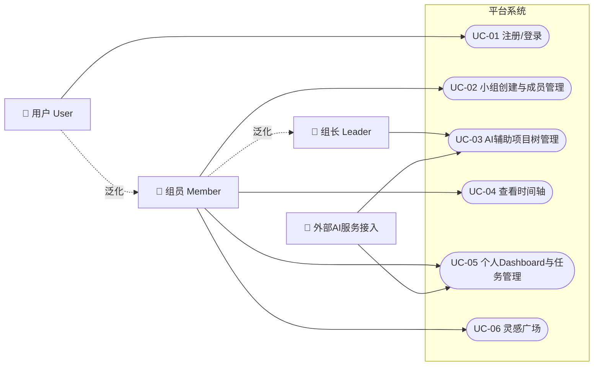

### 3.3 功能列表

#### 3.3.1 用户注册与登录

**用例文档**

| 字段     | 内容                                         |
| -------- | -------------------------------------------- |
| 用例编号 | UC-01                                        |
| 参与者   | 用户（未登录状态）                           |
| 前置条件 | 用户已打开平台首页，尚未登录                 |
| 后置条件 | 用户成功登录，系统创建会话，跳转至 Dashboard |
| 优先级   | 高                                           |

**基本流程：** 用户填写学号/手机号与密码点击登录，系统验证凭证后生成 JWT Token 跳转 Dashboard。注册时额外需填写姓名、专业并通过短信验证码验证。

**替代流程：** 学号已存在提示重复；验证码过期；密码错误5次锁定账号15分钟。

**注册时序图：**

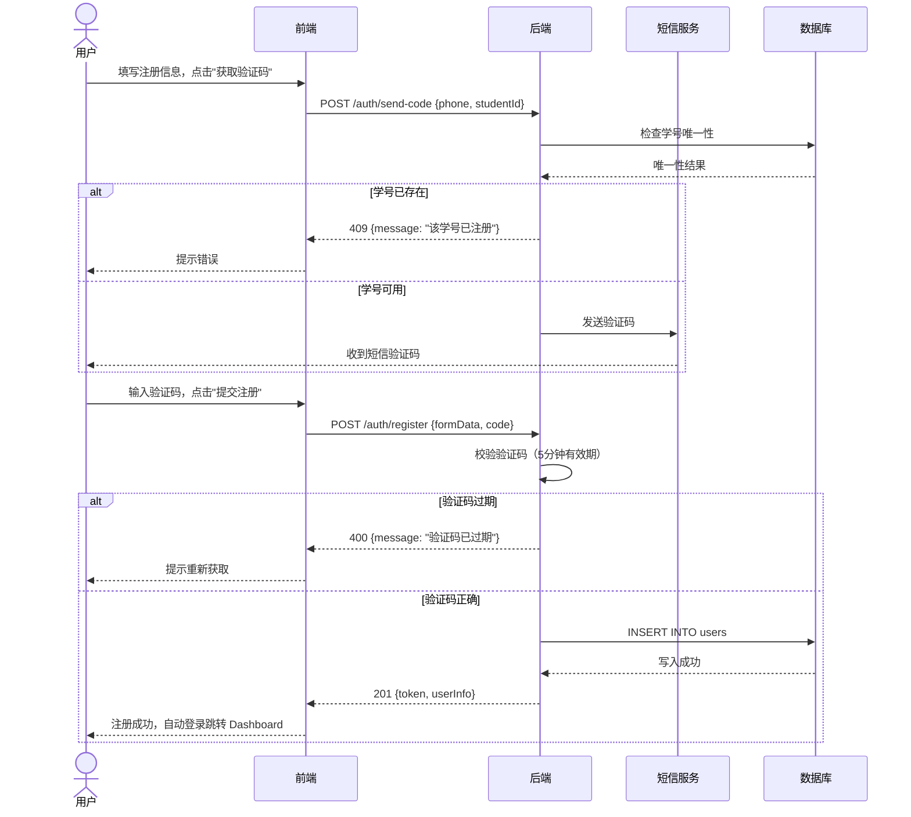

**登录时序图：**

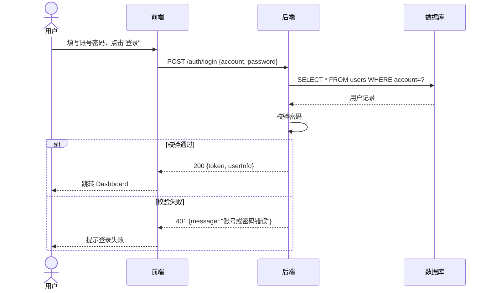

#### 3.3.2 小组创建与成员管理

**用例文档**

| 字段     | 内容                                           |
| -------- | ---------------------------------------------- |
| 用例编号 | UC-02                                          |
| 参与者   | 组员（创建者自动成组长）、组长                 |
| 前置条件 | 用户已登录                                     |
| 后置条件 | 小组状态变更（创建/加入/踢出/转让/解散）持久化 |
| 优先级   | 高                                             |

**主要操作：** 创建小组并生成邀请码；凭邀请码加入小组；组长踢出组员/转让身份/解散小组；组员退出小组。

**替代流程：** 邀请码无效或过期提示错误；解散操作需二次确认。

**响应时序图：**

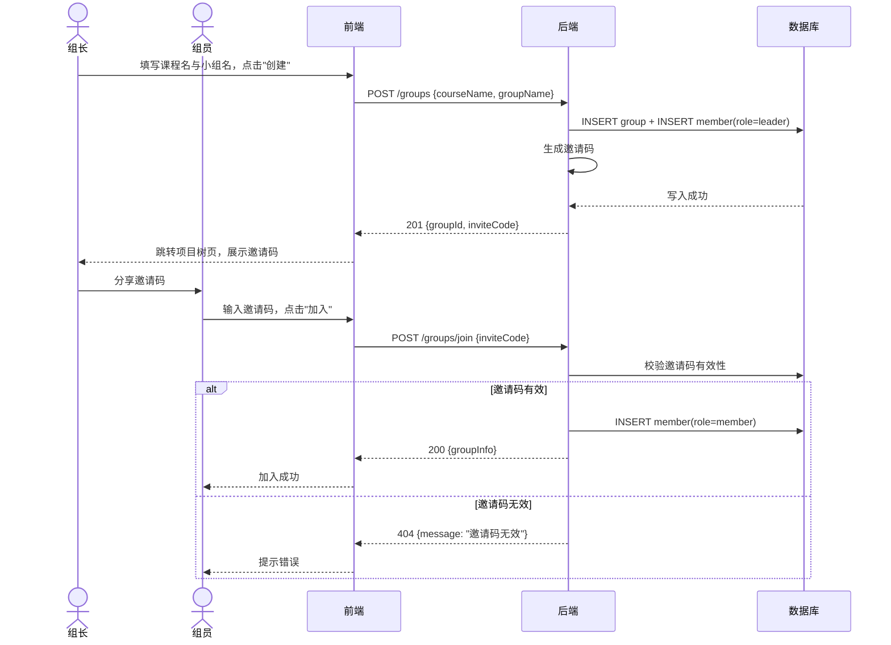

#### 3.3.3 AI 辅助项目树管理

**用例文档**

| 字段     | 内容                                                         |
| -------- | ------------------------------------------------------------ |
| 用例编号 | UC-03                                                        |
| 参与者   | 组长（生成/编辑）、组员（查看）、外部AI服务                  |
| 前置条件 | 组长已创建小组，进入项目树页面                               |
| 后置条件 | 项目树（含任务节点、层级、负责人、DDL）创建或更新完成并持久化 |
| 优先级   | 高                                                           |

**主要操作：**

- **生成：** 组长上传课程文档或输入文字描述，AI结合组员技能标签生成项目树草案，组长预览确认后持久化。
- **编辑：** 组长通过自然语言指令驱动 AI 修改项目树（支持多轮迭代），或直接点击节点手动编辑名称/负责人/DDL。
- **查看（全体）：** 组员可查看完整项目树，开启"仅看我的"专注模式，点击节点查看任务详情并跳转时间轴/灵感广场。

**替代流程：** AI超时（>30s）提示重试；可从灵感广场一键导入模板代替AI生成。

**响应时序图（AI生成项目树）：**

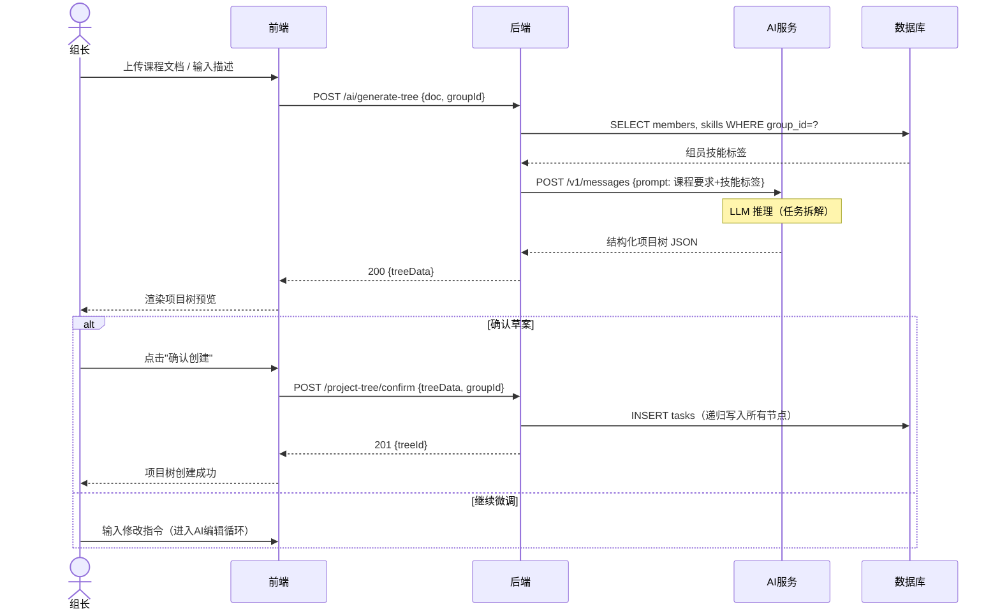

**响应时序图（AI对话编辑）：**

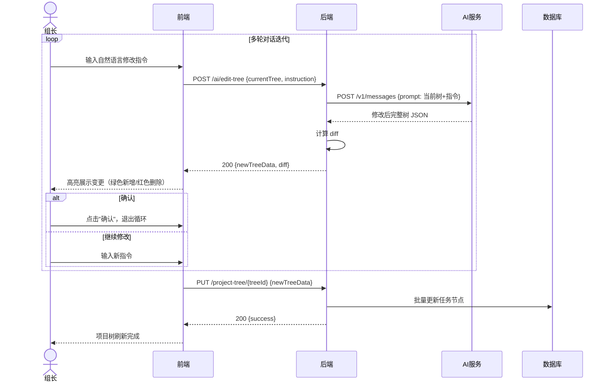

#### 3.3.4 查看时间轴（甘特图）

**用例文档**

| 字段     | 内容                                             |
| -------- | ------------------------------------------------ |
| 用例编号 | UC-04                                            |
| 参与者   | 组员、组长                                       |
| 前置条件 | 项目树已创建且包含原子任务，进入"时间轴"视图     |
| 后置条件 | 用户看到以人员为泳道、原子任务为彩色区块的甘特图 |
| 优先级   | 高                                               |

**主要操作：** 查看各成员任务排期；切换周/月视图；点击任务区块查看详情；接近 DDL 的任务以预警色标注。

**响应时序图：**

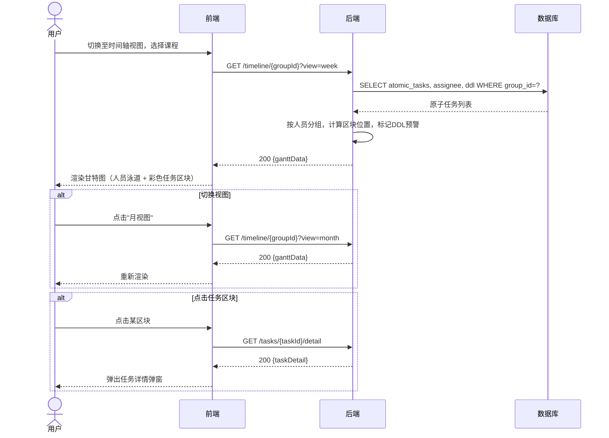

#### 3.3.5 个人 Dashboard 与任务管理

**用例文档**

| 字段     | 内容                                             |
| -------- | ------------------------------------------------ |
| 用例编号 | UC-05                                            |
| 参与者   | 组员、组长、外部AI服务                           |
| 前置条件 | 用户已登录，已加入至少一个课程小组               |
| 后置条件 | 用户看到跨课程任务列表与AI建议，并可更新任务状态 |
| 优先级   | 高                                               |

**主要操作：**

- **任务列表：** 跨课程聚合所有分配给本人的原子任务，按 DDL 升序排列；存在24h内截止时显示紧急预警横幅。
- **AI 智能提醒：** 每次进入时自动生成个性化每日建议（今日重点 + 风险提示）；组长额外收到小组整体进度摘要。
- **更新任务状态：** 组员将本人任务在"待办 → 进行中 → 已完成"间流转，系统联动更新父节点完成度。

**任务状态流转图：**

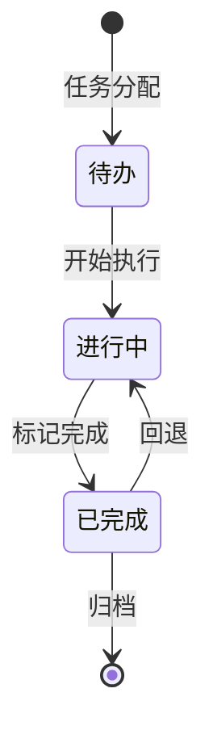

**响应时序图：**

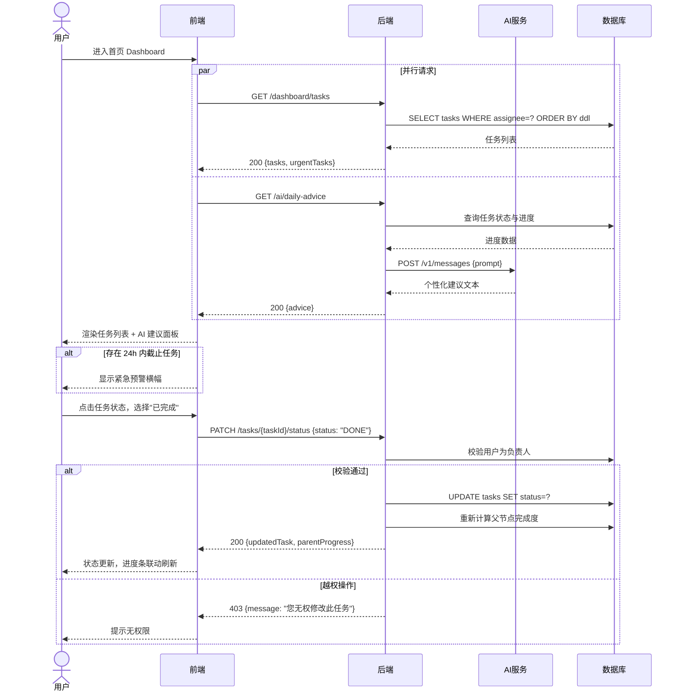

#### 3.3.6 灵感广场

**用例文档**

| 字段     | 内容                                                         |
| -------- | ------------------------------------------------------------ |
| 用例编号 | UC-06                                                        |
| 参与者   | 组员、组长                                                   |
| 前置条件 | 用户已登录，进入"灵感广场"页                                 |
| 后置条件 | 用户成功浏览/搜索到资源，或发布资源，或将模板导入为项目树草案 |
| 优先级   | 中                                                           |

**主要操作：**

- **浏览/搜索：** 关键词全文搜索；按课程/类别/最新发布 Tab 切换；支持点赞、收藏、评论。
- **发布资源：** 填写标题/类型/课程标签/正文（可上传附件）后提交发布；从任务详情"分享至灵感广场"可预填充信息。
- **一键导入模板（组长）：** 组长在模板类资源详情页点击"导入为项目树"，系统深拷贝模板结构（清空负责人/DDL）写入本小组项目树草案。

**替代流程：** 内容违规提示修改；已有项目树时导入需二次确认覆盖。

**响应时序图：**

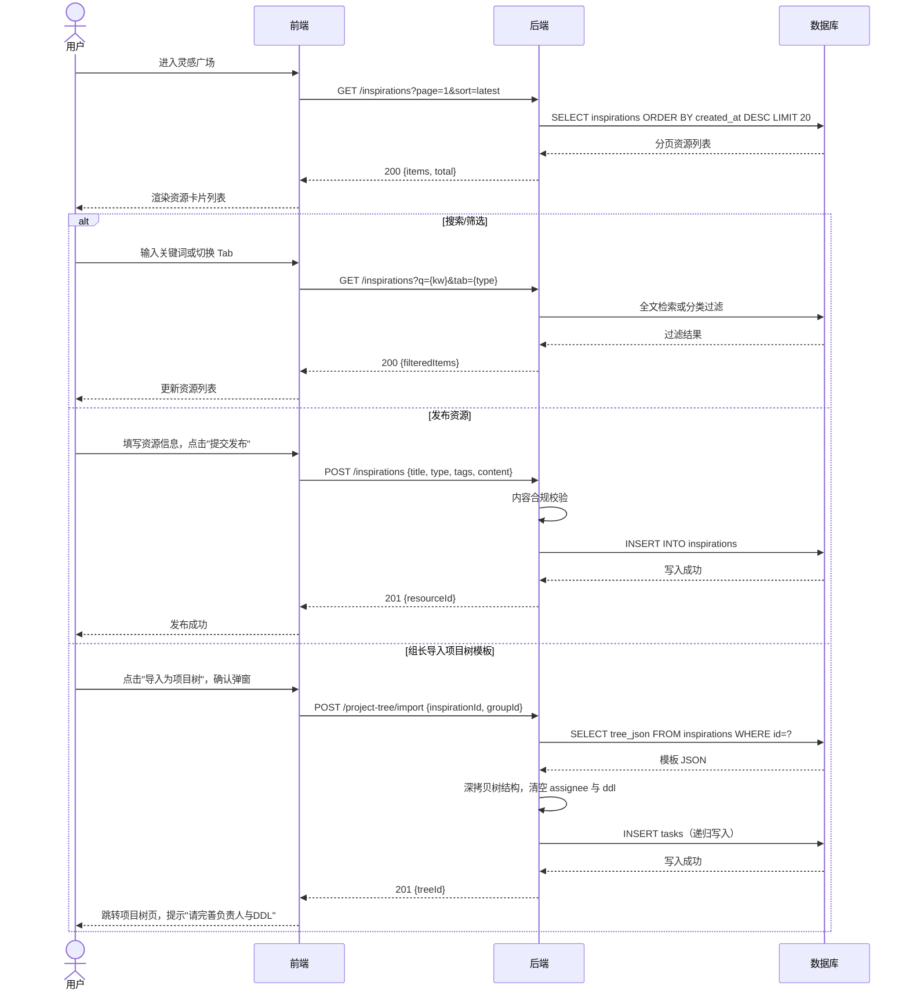

## 4 类图与 CRC 模型

### 4.1 核心类抽象

根据系统的总体描述与数据库设计方案，系统主要包含以下核心类：

- **User（用户类）** ：系统的主体，区分不同的能力标签（Skills)与基本信息。
- **Group（小组类）** ：课程协作的上下文容器，实行“组长负责制”。
- **Course（课程类）& Major（专业类)** ：系统的基础字典数据类，用于关联小组和用户。
- **Task（任务类）** ：系统的核心逻辑类，通过 `parent_id` 实现树状嵌套（项目树），并包含是否为原子任务（ `is_atomic` ）的标识。
- **Inspiration（灵感类）** ：灵感广场的内容载体，支持 JSON 格式的项目树模板与 Markdown 文本存储。
- **Interaction（互动类）** ：记录用户在灵感广场中的点赞、收藏、评论行为。

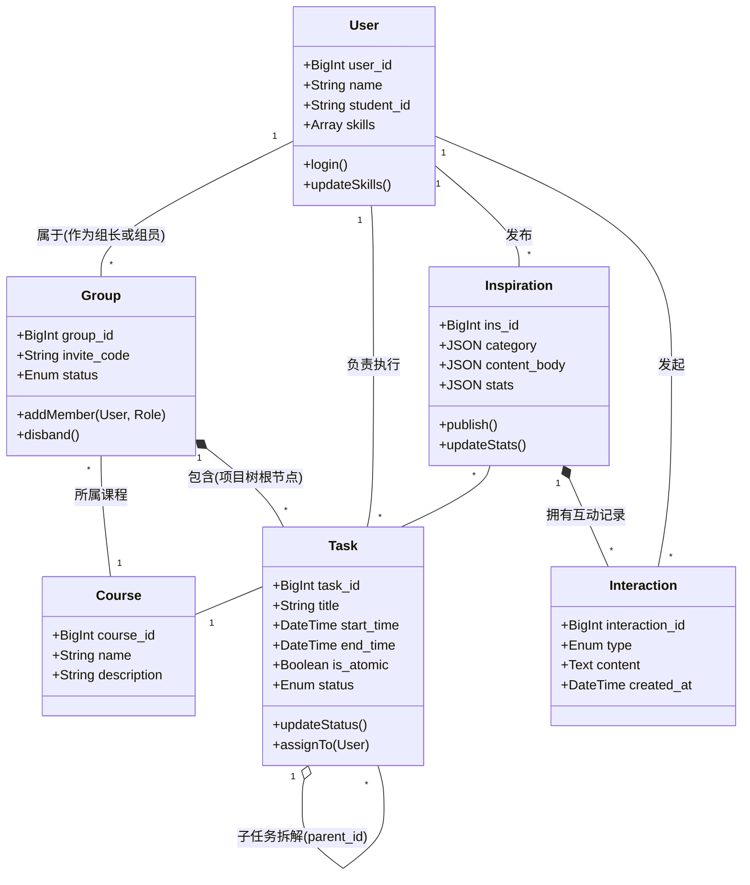

### 4.2 CRC 模型

以下是核心业务类的 CRC 模型定义：

#### 4.2.1 User（用户）类

| **类名**                                                     | **User**                        |
| ------------------------------------------------------------ | ------------------------------- |
| **职责 (Responsibilities)**                                  | **协作者**  **(Collaborators)** |
| 1. 维护个人基本信息（姓名、学号、专业）与账户安全。          | Major                           |
| 2. 管理个人技能标签（如“PPT制作”、“摄影”），为 AI 任务分配提供数据支撑。 | Task, Group                     |
| 3. 作为组长或组员身份加入、创建或退出课程小组。              | Group                           |
| 4. 在灵感广场发布、浏览内容并进行互动。                      | Inspiration,  Interaction       |

#### 4.2.2 Group（小组）类

| **类名**                                                     | **Group**                       |
| ------------------------------------------------------------ | ------------------------------- |
| **职责 (Responsibilities)**                                  | **协作者**  **(Collaborators)** |
| 1. 管理小组的基础信息、所属课程及状态（进行中/已解散）。     | Course                          |
| 2. 维护小组成员名单，并严格区分成员权限（组长  leader / 组员 member  ）。 | User                            |
| 3. 作为项目树的顶层容器，承载该小组所有的项目任务。          | Task                            |

#### 4.2.3 Task（任务）类

| **类名**                                                     | **Task**                        |
| ------------------------------------------------------------ | ------------------------------- |
| **职责 (Responsibilities)**                                  | **协作者**  **(Collaborators)** |
| 1. 记录任务的基本属性（标题、描述、开始时间、截止日期 DDL、当前状态）。 | User (Assignee)                 |
| 2. 维护递归式树状结构（通过指向父任务的属性实现层级拆解）。  | Task (Parent Task)              |
| 3. 标识任务粒度（是否为不可再拆分的原子任务 is_atomic ），以供时间轴排期和底层执行使用。 | Group                           |

#### 4.2.4 Inspiration（灵感）类

| **类名**                                                     | **Inspiration**                 |
| ------------------------------------------------------------ | ------------------------------- |
| **职责 (Responsibilities)**                                  | **协作者**  **(Collaborators)** |
| 1. 存储灵感内容（项目树模板、参考案例、经验贴等），并关联目标课程。 | User (Author), Course           |
| 2. 维护灵感热度统计数据（点赞数、收藏数、评论数）。          | Interaction                     |

#### 4.2.5 Interaction（互动）类

| **类名**                                                     | **Interaction**                 |
| ------------------------------------------------------------ | ------------------------------- |
| **职责 (Responsibilities)**                                  | **协作者**  **(Collaborators)** |
| 1. 记录用户对灵感内容的具体交互行为（点赞 LIKE、收藏 COLLECT、评论 COMMENT）。 | User, Inspiration               |

## 5 非功能性需求

### 5.1 性能需求

- 系统应保证运行稳定，避免出现频繁崩溃或长时间无响应的情况。
- 系统应支持目前各主流浏览器（Chrome、Firefox、Edge、Safari 及其较新版本）的正常访问。
- 系统应能支持至少 50 个课程小组并发在线协作，总在线用户数不少于 200 人。
- 对于用户在 Dashboard、项目树、时间轴等页面的常规操作，系统应在 3 秒以内做出响应。
- 对于 AI 辅助类操作（如项目树生成、每日建议生成等），由于需要调用外部大模型 API，响应时间可放宽至 30 秒以内，并在等待期间向用户展示加载提示。
- 每个页面在正常网络环境下应在 3 秒内加载完毕，高峰期应在 8 秒内加载完毕。
- 登录成功后采用 Token（如 JWT）机制维护会话，Token 默认有效期为 24 小时；用户在 30 分钟内无操作时应自动要求重新认证。
- 系统应能及时检测并报告非正常情况，如数据库连接失败、AI 服务接口超时等，避免用户长时间无反馈等待。
- 系统应保证在一周内计划性维护与重启不超过一次。

### 5.2 输入要求

- 所有用户输入必须经过前端校验与后端二次校验，前端校验不得作为唯一的安全屏障。
- 用户在注册与登录时，应对账号、密码的合法性与安全性进行校验，拒绝空值及非法字符输入。
- 用户在编辑项目树节点、填写任务描述、发布灵感广场内容时，应对文本长度进行限制，防止超长内容影响页面渲染与数据库存储。
- 用户在上传课程要求文档用于 AI 项目树生成时，应对文件类型和文件大小进行校验，单文件大小不超过 20MB。
- 用户在甘特图中设置任务起止时间时，系统应校验日期合理性，避免出现结束时间早于开始时间的情况。
- 对用户输入内容（灵感广场发帖、评论、任务描述等）进行转义或过滤处理，防止特殊符号和 HTML/JavaScript 代码直接写入页面造成渲染异常。
- 对提交给 AI 服务的 Prompt 进行基本的关键词过滤，防止 Prompt 注入攻击；对 AI 返回内容进行合理性校验后再呈现给用户。
- 系统应通过合理的前后端校验机制，尽量降低由用户人为错误引发的系统异常概率。

### 5.3 数据传输及并发要求

- 所有前后端通信必须采用 HTTPS 协议加密传输，禁止通过明文 HTTP 传递用户数据。
- 用户点击登录按钮后，登录响应时间不应超过 3 秒，在此时间内将登录结果反馈给用户。
- 系统应支持 10 名用户同时上传课程要求文档或灵感广场资源， 20 名用户同时下载灵感广场中的模板与资源。
- 系统应支持同一小组内多名成员同时对项目树和任务状态进行查看与编辑，并保证数据最终一致性。
- 涉及多表联动的操作（如解散小组时级联删除任务、解除成员关系）须通过数据库事务保证原子性与一致性，避免出现部分成功的脏数据。
- 当多个组员同时更新任务状态时，系统应按照时间顺序处理请求，避免因并发写入导致数据覆盖或丢失。
- 系统生成的前端页面，在常规网络环境下应能够在 3 秒内完成加载和渲染。

### 5.4 数据管理需求

系统既要保障对外部 AI 服务的正常调用，又必须保证本系统自身数据的独立性与完整性，防止未经授权的访问、修改与破坏。具体要求如下：

- 系统服务器应具备不少于 20GB 的存储空间，用于存放用户数据、课程数据、项目树、灵感广场内容以及用户上传文件。
- 数据库应能够支持单表不少于 10 万条记录，满足日常课程小组协作的数据规模需求。
- 用户密码必须通过加盐哈希算法（如 bcrypt 或 Argon2）加密存储，严禁明文存储或使用单一 MD5/SHA1 等不安全算法。
- 手机号、邮箱等敏感信息在非必要场景下须进行脱敏展示（如 `138****1234`）。
- 系统日志与操作记录的数据增长预计为 10MB/月，具体增长量依系统使用频率而定。
- 学期初与新课程批量导入期间，系统数据可能出现较大幅度增长（预计约 200MB），系统应具备对应的存储冗余能力。
- 系统应定期对数据库进行增量备份，并保留不少于 7 天的备份历史。
- 当发生重大事故造成数据丢失时，系统应能够基于备份数据在 48 小时内恢复至可用状态。

### 5.5 权限与安全需求

安全性是保障系统正常运行的关键因素之一。结合 CoTask 中"组长-组员"权限分级机制，对权限与安全进行如下设计：

**访问控制：**

- 除浏览灵感广场部分公开资源外，用户必须登录后才能进行其他操作。
- 用户密码应满足一定的强度要求：长度不少于 8 位，且必须包含数字与字母的组合。
- 同一账号在短时间内连续 5 次登录失败后，应触发账号临时锁定或验证码校验机制。
- 系统应严格按照"组长"与"组员"的权限划分控制页面元素与接口访问，组员不得调用仅限组长的接口（如项目树编辑、解散小组、组员管理等）。
- 所有涉及小组数据的接口必须在服务端二次校验请求者是否属于该小组，防止水平越权（跨小组访问他人数据）与垂直越权（组员越权执行组长操作）攻击。
- 用户在灵感广场中只能编辑与删除自己发布的内容，不可修改他人发布的资源。
- 只有系统管理员有权查看系统日志，且任何人均无权删除或篡改日志。

**攻击防御：**

- 所有数据库查询必须使用参数化查询或 ORM 框架（如 SQLAlchemy），禁止直接拼接 SQL 语句，防范 SQL 注入攻击。
- 对涉及状态变更的关键接口启用 CSRF Token 或 SameSite Cookie 策略，防范跨站请求伪造。
- 对登录、注册、AI 调用等敏感接口进行访问频率限流，防止暴力破解与恶意刷取。
- 对用户上传的文件进行类型、大小校验与基础安全扫描，防止可执行脚本等恶意文件上传。
- 对于外部 AI 服务的调用，系统不应将用户敏感信息（如姓名、学号、联系方式）直接传递给外部 API。

**日志与审计：**

- 系统应记录用户的关键操作（登录、注册、任务状态变更、项目树编辑、灵感广场发布等），便于审计与问题追踪。
- 后端所有未预期异常须记录完整的堆栈信息，便于开发人员快速定位问题。
- 对可能产生严重后果的操作（如解散小组、删除项目树节点）应设置二次确认机制，允许用户在操作前取消。

### 5.6 软件质量属性

- **可用性**：本系统作为课程协作辅助工具，应保证在每周 7 天、每天 24 小时的时间范围内，至少 97% 的时间可正常使用。
- **易用性**：系统界面应简洁清晰，符合大学生用户的使用习惯；新用户在无专门培训的情况下，应能在 10 分钟内掌握项目树创建、任务查看和灵感广场浏览等核心操作。
- **鲁棒性**：当用户在编辑任务或发布灵感内容的过程中发生网络中断，系统应能够在重新连接后恢复未提交的内容，避免数据丢失。后端代码应对关键操作进行异常捕获与日志记录，避免单点异常扩散至整个系统。
- **可靠性**：系统在连续运行期间应保持功能稳定，核心模块（任务管理、权限控制、时间轴渲染）不应出现明显的功能退化。
- **外部依赖容错**：当外部 AI 服务不可用时，系统核心功能（任务管理、时间轴查看、灵感广场浏览）不受影响，系统以明显提示告知用户 AI 功能暂时不可用，允许用户以手动方式继续完成协作操作。
- **兼容性**：系统应在 Windows、macOS、Linux 等常见操作系统下的主流浏览器中保持一致的显示效果与功能表现；前端采用响应式设计，在常见屏幕宽度（1920×1080、1440×900、1366×768）下均应有良好显示；核心功能（查看任务、更新状态、浏览灵感广场）应在屏幕宽度不小于 375px 的移动端浏览器中可用。

### 5.7 可视化需求

用户在完成操作后，需要及时获得反馈，以判断操作是否成功。为提高系统友好性，对可视化方面做出如下要求：

- 用户上传课程要求文档或灵感广场资源后，应能够立即看到上传的文件名及上传状态。
- 用户下载灵感广场模板或附件时，应显示下载进度条，反映当前下载进度。
- 用户完成任务状态切换后，Dashboard 中对应的任务项应立即更新显示状态，无需手动刷新。
- 组长编辑项目树节点后，应在项目树视图与甘特图视图中即时看到变更结果。
- AI 生成项目树或给出每日建议时，应在界面中提供明显的加载提示，让用户了解当前处于等待状态。
- 对于任务 DDL 临近、超时等紧急情况，应通过颜色标识或提醒卡片给予可视化提示。
- 系统对于用户的每一次关键操作（保存、提交、发布等）都应在界面上给出明确的成功或失败反馈。

### 5.8 防护性需求

- 系统应对用户输入内容进行必要的过滤，防止 SQL 注入、XSS 跨站脚本等常见的 Web 攻击。
- 灵感广场用户上传的内容应通过关键词过滤与举报机制进行基础审核，防止不良内容在社区内传播。
- 对于可能造成数据丢失的操作（例如解散小组、删除项目树根节点、批量删除任务），系统应提供二次确认或撤销窗口。
- 系统应对 AI 服务返回的内容进行基本的合规性检查，过滤明显不当或与系统无关的输出内容。
- 对于灵感广场中的用户发布内容，系统应提供举报入口，便于对违规内容进行人工复核与处理。
- 对服务器 CPU、内存、磁盘、网络等基础指标进行实时监控，关键异常情况触发告警通知运维人员。

### 5.9 可维护性

- **模块化设计**：前端按页面与组件进行划分，后端按业务领域（用户与权限、小组、项目树、时间轴、灵感广场、AI 引擎）划分模块，模块间通过规范化接口通信。
- **前后端分离架构**：采用 Vue 前端 + Flask 后端的前后端分离架构，以支持前后端独立迭代与独立部署。
- **版本控制**：统一使用 Git 进行版本管理，采用 Git Flow 分支策略规范开发与发布流程。
- **接口文档**：所有后端 API 必须具备完整的接口文档（通过 Swagger 或类似工具自动生成），包含请求参数、返回格式与调用示例。
- **代码规范与注释**：代码实现应遵循主流的编码规范（如 Python 的 PEP 8、前端的 ESLint 规则等）；关键业务逻辑、复杂算法与公共组件须提供清晰的代码注释。
- **测试覆盖**：核心业务模块（权限控制、项目树编辑、任务状态流转、AI 服务调用）必须具备单元测试，整体测试覆盖率不低于 60%；关键业务流程（注册登录、项目树创建、任务流转）应具备端到端集成测试。
- **容器化部署**：系统须支持通过 Docker 进行容器化部署，以降低环境依赖与部署复杂度。
- **配置外置**：数据库连接、AI 服务密钥等环境相关配置通过配置文件或环境变量进行管理，严禁硬编码在源码中。
- **日志可读性**：系统日志应结构化输出，便于开发与运维人员检索与定位问题。

### 5.10 其他需求

- **可扩展性**：系统架构应为后续扩展保留空间，例如支持接入更多 AI 模型、新增积分激励系统、扩展到移动端 App 等；重大功能更新宜支持灰度发布机制，降低全量发布带来的风险。
- **国际化**：系统界面默认为简体中文，但在文案管理与组件设计上应考虑后续多语言支持的可能性。
- **隐私保护**：系统应在用户注册与使用过程中明确告知数据收集范围与使用目的，尊重用户的数据知情权与控制权。
- **外部服务依赖**：系统依赖于外部大模型 API，应具备基本的降级策略，当外部 AI 服务不可用时，应允许用户手动完成项目树创建、任务编辑等核心操作，不应导致整个系统无法使用。
- **版权合规**：灵感广场中的内容应明确鼓励用户上传原创或获得授权的资料，系统提供基本的版权声明入口与侵权举报机制。

## 6 数据流图

### 6.1 顶层数据流图

顶层数据流图描述了系统与外部实体（用户、外部 AI 模型服务）之间的宏观数据交互关系。 

- **外部实体**：用户（区分为“组长”与“组员”角色)、外部 AI服务接口。
- **输入数据流**：
  - **用户**：注册登录信息、课程要求文档/文本、项目树编辑指令、个人技能标签、任务状态更新、灵感内容发布/互动指令。
  - **外部** **AI** **服务**：生成的项目树结构 JSON、任务分配建议、个性化每日进度建议。
- **输出数据流**：
  - **平台 -> 用户**：可视化的项目树视图、时间轴（甘特图）排期表、待办任务预警、灵感广场干货资源、AI 每日建议报告。
  - **平台 -> 外部 AI 服务**：环境上下文（当前项目树状态、组员技能标签数组、原始课程作业要求）。

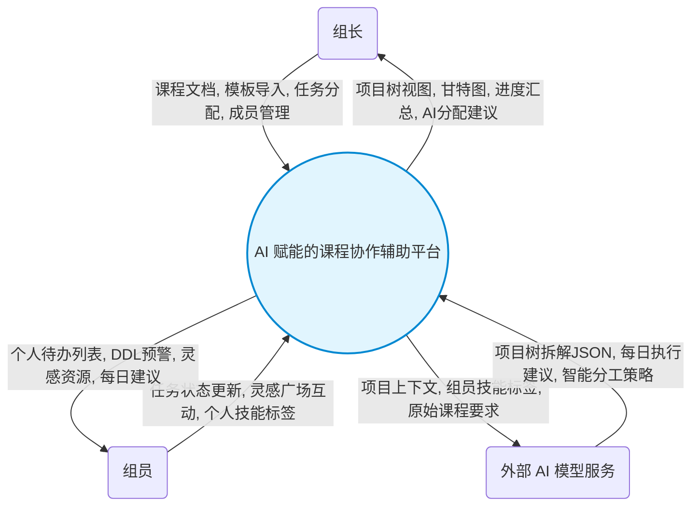

### 6.2 一层和二层数据流图

将平台的主体加工过程进一步细化，系统可分为四个核心处理模块及对应的数据存储库（Data Stores）。

#### 6.2.1 主要数据存储（Data Stores）

- **D1 用户与权限库**：对应  users ,  majors ,  group_members 表。

- **D2 小组与项目库**：对应  groups ,  tasks 表。

- **D3 灵感资源库**：对应  inspirations ,  user_interactions 表。

- **D4 字典信息库**：对应  courses 表。

#### 6.2.2 核心处理过程（Processes）与数据流转

##### P1：用户与身份认证模块

- **处理逻辑**：接收用户的注册/登录请求，维护个人技能标签（如“PPT制作”），处理组长创建小组或组员凭借邀请码加入小组的动作。
- **数据流**：验证信息写入 **D1用户与权限库**；小组创建与关联记录写入 **D2小组与项目库**。

##### P2： 项目树与时间轴管理模块

- **处理逻辑**：这是管理层面的核心。接收组长导入的模板或 AI 拆解的结构，进行任务节点（Task）的增删改查。维护父子节点的关联（ parent_id ），配置原子任务的时间区间（开始/截止时间）与负责人。组员在此模块仅能读取并更新个人负责的原子任务状态。
- **数据流**：频繁读取与更新 **D2小组与项目库**；从 **D1用户与权限库** 读取组成员信息用于分配任务。

##### P3： AI 智能引擎交互模块

- **处理逻辑**：
  - **场景A（项目初始化)** ：提取用户上传的课程要求或基于灵感模板，向 AI 请求递归式任务拆解方案。
  - **场景B（智能分配)** ：读取 **D1** 中的组成员技能标签，向 AI 请求分工建议。
  - **场景C（进度预警)** ：比对 **D2** 中的 DDL 与当前状态，生成“紧急预警”与“个性化每日建议”返回给首页 Dashboard。

- **数据流**：整合 D1、 D2 数据发送至外部 AI 接口；将 AI 返回的结构化数据转译后写入 D2 或直接推送至前端界面。

##### P4：灵感广场社区模块

- **处理逻辑**：处理全链条的灵感沉淀与消耗。接收用户的查询条件进行检索过滤；处理用户点赞、收藏、评论行为；支持组长一键将优秀模板导入到当前的“项目树与时间轴管理模块”。
- **数据流**：数据的增删改查主要在 **D3 灵感资源库** 中进行；若发生一键导入行为，数据将由 D3 格式化后流入 **D2 小组与项目库**。

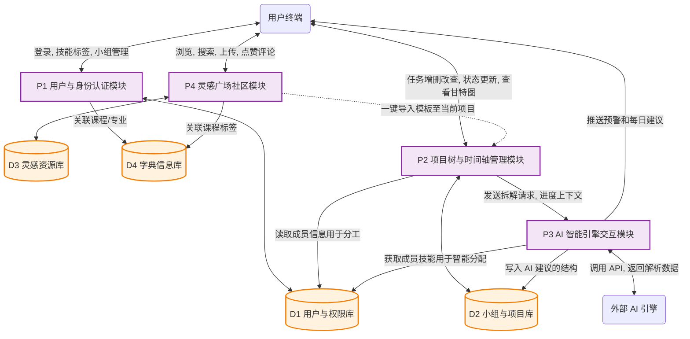

## 7 验收准则

### 7.1 功能要求

本系统需要完整实现第三章所列出的全部功能模块，并通过相应的功能测试。CoTask 平台的核心功能需满足以下验收要求：

- **用户与小组管理**：用户能够完成注册、登录、退出等基础流程；同一用户可加入多个不同课程的小组，并在不同小组中扮演不同角色；组长能够正常进行邀请组员、移除组员、转让组长身份以及解散小组等操作。
- **项目树管理**：组长能够通过导入项目树模板或上传课程要求文档与 AI 对话两种方式生成初始项目树；能够在树状视图中进行增、删、改节点操作；组员仅具有查看权限而无编辑权限。
- **时间轴与甘特图**：项目页支持"项目树"与"甘特图"两种视图的无缝切换；甘特图能够以成员为纵轴、时间为横轴正确展示任务排期，支持周视图与月视图切换；原子任务能够精准映射至对应成员的日期区间。
- **个人 Dashboard**：组员能够在首页看到所有课程的待办原子任务列表，支持按日期或按课程排序；能够点击任务查看详情弹窗，并从弹窗中跳转至项目树位置或灵感广场；任务状态（未开始、进行中、已完成）可由本人自行流转。
- **灵感广场**：用户能够按分类、关键词搜索资源；能够查看经验贴、模板与参考案例详情；能够一键将项目树模板导入到自己的小组中；能够发布个人的优秀方案与经验总结。
- **AI 辅助功能**：AI 项目树生成、任务分配建议、每日个性化建议、灵感推荐等能力均应能够正常调用并返回合理结果；AI 返回内容允许用户审阅、修改和重构，不强制执行。
- **权限控制**：组长与组员的权限边界清晰，组员无法通过任何前端或后端接口执行仅限组长的操作。

### 7.2 性能要求

#### 7.2.1 响应时间

根据软件测试的 2/5/10 原则：2 秒内的响应被用户视为"非常有吸引力"，5 秒内的响应被视为可接受，超过 10 秒大部分用户会选择离开。结合 CoTask 的实际使用场景，对页面切换与弹窗处理的响应时间提出如下要求：

| 项目动作              | 响应时间 | 说明                                          |
| --------------------- | -------- | --------------------------------------------- |
| 首页（Dashboard）加载 | < 3s     | 用户登录后跳转到 Dashboard 至任务列表完整展示 |
| 登录跳转              | < 3s     | 用户点击登录按钮到跳转至对应角色首页完成      |
| 导航栏切换            | < 3s     | 用户在左侧导航栏点击模块到目标页面加载完毕    |
| 项目树视图加载        | < 3s     | 用户点击项目页到项目树完整渲染                |
| 甘特图视图切换        | < 3s     | 用户从项目树视图切换到甘特图视图到完整渲染    |
| 任务详情弹窗打开      | < 1s     | 用户点击任务项到弹窗展示任务详情              |
| 灵感广场资源搜索      | < 3s     | 用户输入关键词点击搜索到搜索结果列表展示      |
| 个人中心加载          | < 3s     | 用户点击个人中心到档案信息完整展示            |

#### 7.2.2 更新处理时间

CoTask 作为多人协作平台，数据的更新与同步直接影响协作效率。对数据更新处理时间提出如下要求：

| 项目过程              | 更新处理时间 | 说明                                              |
| --------------------- | ------------ | ------------------------------------------------- |
| 任务状态更新          | < 3s         | 组员标记任务状态变化到 Dashboard 与项目树同步显示 |
| 项目树节点编辑        | < 3s         | 组长编辑节点信息到所有组员视图同步更新            |
| 甘特图任务排期调整    | < 3s         | 组长拖动或编辑任务时间到甘特图重新渲染            |
| 小组成员变更          | < 3s         | 邀请、移除组员或转让组长到所有相关页面同步生效    |
| 灵感广场内容发布      | < 3s         | 用户点击发布到内容出现在灵感广场列表              |
| 个人档案/技能标签更新 | < 3s         | 用户修改档案信息到档案页面同步显示                |

#### 7.2.3 数据传输与处理时间

对于文件上传下载以及 AI 服务调用，由于涉及网络传输或外部 API 调用，时间指标相对宽松，但系统应始终提供可视化的进度或加载提示，避免用户盲目等待：

| 项目过程         | 处理时间             | 说明                                             |
| ---------------- | -------------------- | ------------------------------------------------ |
| 课程要求文档上传 | 取决于文件大小与网速 | 上传过程中显示进度条，单文件大小不超过 20MB      |
| 灵感广场附件下载 | 取决于文件大小与网速 | 下载过程中显示进度条与剩余时间                   |
| AI 项目树生成    | < 30s                | 从用户提交 Prompt 到初始项目树在页面展示         |
| AI 任务分配建议  | < 30s                | 从组长点击"AI 分配"到建议结果展示                |
| AI 每日建议生成  | < 30s                | Dashboard 加载时在后台生成，不阻塞其他内容的展示 |
| AI 灵感推荐      | < 30s                | 从用户进入任务详情到对应灵感推荐展示             |

AI 类操作均应在界面提供明显的加载提示；若调用超时，系统应给出友好提示并允许用户重试。

### 7.3 存储要求

由于 CoTask 系统中的用户信息、小组关系、项目树、任务、灵感广场内容、操作日志等数据主要通过数据库与文件系统进行存储，应根据数据规模合理规划存储空间。主要存储要求如下：

- 服务器应具备不少于 **20GB** 的总存储空间，用于存储数据库数据、用户上传文件、系统日志及备份文件。
- 数据库中每张核心业务表应能支持不少于 **10 万条记录**，满足日常课程小组协作的数据规模需求。
- 为每个小组预留一定的文件存储配额（单个小组建议不超过 500MB），防止个别小组上传过多文件挤占整体空间。
- 系统日志与操作记录的增长速率预计为 10MB/月，日志文件应按周或按月滚动归档。
- 应定期进行数据库增量备份，备份文件日期不少于 7 天。

### 7.4 维护要求

系统开发与运维过程中，团队应遵循以下维护规范，以保证系统的长期可持续运行：

- **开发日志**：开发人员须在开发过程中记录开发日志，包括每次功能迭代、Bug 修复与重要决策，便于问题追溯与经验沉淀。
- **环境统一**：开发、测试与部署环境须通过 Docker 进行统一管理，避免因环境差异导致的问题；数据库、AI 服务密钥等环境相关配置通过环境变量管理，严禁硬编码。
- **版本控制**：统一使用 Git 进行源代码管理，采用 Git Flow 分支策略；每次提交须附带清晰的提交信息；重要版本须打 Tag 并记录更新日志。
- **代码维护**：开发人员须时刻对源代码进行审查与维护，关键业务逻辑与复杂算法须提供清晰的代码注释；遵循主流编码规范（Python 的 PEP 8、前端 ESLint 规则）。
- **接口文档**：所有后端 API 须具备通过 Swagger 或同类工具自动生成的接口文档，并随代码一起维护更新。
- **日志与监控**：系统运行过程中的关键操作与异常均须记录日志；对服务器 CPU、内存、磁盘、网络等基础指标进行实时监控，关键异常情况触发告警通知运维人员。
- **问题反馈机制**：系统应向用户提供问题反馈入口

### 7.5 测试与验收方法

为确保系统交付质量，本项目将采用如下测试与验收方法：

- **单元测试**：对核心业务模块（权限控制、项目树编辑、任务状态流转、AI 服务调用）编写单元测试，整体测试覆盖率不低于 60%。
- **集成测试**：针对关键业务流程（注册登录、项目树创建、任务状态流转、灵感广场发布）开展端到端集成测试，保证跨模块数据流动与交互正确。
- **性能测试**：进行并发压测，验证在 200 人同时在线、50 个小组并发协作的场景下，核心接口响应时间与页面加载时间符合 7.2 节的指标要求。
- **兼容性测试**：在 Chrome、Firefox、Edge、Safari 等主流浏览器最新版本下验证系统的显示与功能一致性；在 1920×1080、1440×900、1366×768 三种常见分辨率下验证响应式布局；在屏幕宽度 ≥ 375px 的移动端浏览器下验证核心功能可用性。
- **安全测试**：针对 SQL 注入、XSS 跨站脚本、CSRF 跨站请求伪造、越权访问（水平越权与垂直越权）等常见安全问题进行专项测试。
- **验收通过标准**：以上各类测试均完成；核心功能测试通过率达到 100%，其他功能测试通过率不低于 95%；未发现严重级别（Critical）的遗留缺陷。

## 8 UI 原型

### 8.1 页面结构总览

| **模块** | **核心目标**                   | **主要交互**                                  |
| -------- | ------------------------------ | --------------------------------------------- |
| 首页     | 聚合展示待办事项与 AI 智能提醒 | 任务列表点击查看详情，支持按日期/课程切换。   |
| 项目页   | 完成任务拆解与小组排期管理     | 支持项目树/甘特图切换、课程切换、编辑与筛选。 |
| 灵感广场 | 沉淀经验帖、模板与参考案例     | 支持分类筛选、搜索和资源卡片浏览。            |
| 个人中心 | 管理档案信息与小组协作关系     | 支持资料编辑、技能展示、我的小组查看与管理。  |

### 8.2 首页原型设计

首页承担系统入口与个人任务概览的功能，页面顶部展示日期和问候信息，中部通过 AI 智能提醒卡片突出当前最紧急事项，下方集中展示待办任务列表。该设计将“提醒”和“执行”放在同一视野内，便于用户快速判断优先级并进入具体任务处理。

图 8-1 首页原型图

任务详情弹窗用于展示单个任务的完整上下文信息，包括任务说明、截止时间、执行人、我的职责及上级主管等。弹窗底部提供“项目树定位”“灵感参考”“完成”等快捷操作，使用户可以在不离开当前页面的前提下完成查看、跳转与处理。

图 8-2 任务详情弹窗原型图

### 8.3 项目页原型设计

项目页用于支持课程任务拆解与小组排期管理，是平台的核心协作界面。页面支持课程切换，并提供“项目树”和“甘特图”两种视图，以满足结构分析和进度管理两类不同需求。

#### 8.3.1 项目树视图

项目树视图以层级结构展示课程任务及其子任务关系，从顶层课程主题逐步下钻到具体执行项。不同颜色的节点用于区分任务层级与责任分配信息，帮助组员快速理解任务拆分逻辑；页面右下角的权限提示则用于说明当前编辑权由组长统一管理。

图 8-3 项目页项目树视图原型图

#### 8.3.2 甘特图视图

甘特图视图沿成员和时间两个维度展示排期结果，适用于观察任务起止区间、成员负载以及项目推进节奏。界面支持周视图和月视图切换，并通过彩色时间块直观标识任务所属成员和计划时段，从而提升协作过程的可追踪性。

图 8-4 项目页甘特图视图原型图

### 8.5 灵感广场原型设计

灵感广场用于沉淀课程协作中的经验贴、模板和参考案例。页面采用搜索框加分类标签的双重检索方式，支持“全部”“经验贴”“模板”“参考案例”等维度筛选；主体内容以资源卡片的形式呈现，使用户能够快速比较标题、适用课程和受欢迎程度，并进入详情页面进行复用。

图 8-5 灵感广场原型图

### 8.6 个人中心原型设计

个人中心由“我的档案”和“我的小组”两个子页面组成，分别对应个人信息维护和协作关系管理。该模块承担用户身份展示、技能沉淀和小组入口聚合的作用，是平台的个体化操作中心。

#### 8.6.1 我的档案

“我的档案”页面展示用户的头像、姓名、学号、邮箱、专业等基础信息，并提供编辑资料入口。页面下方以标签形式呈现用户技能，用于辅助后续任务分配与匹配；右侧则集中布置密码修改和退出登录等账号安全功能。

图 8-6 我的档案原型图

#### 8.6.2 我的小组

“我的小组”页面用于展示用户当前加入的小组列表，页面突出展示小组名称、成员数量、状态和当前身份标签，并保留新建小组及更多操作入口，以支持后续扩展邀请成员、组员管理和组长转让等协作管理功能。

图 8-7 我的小组原型图
